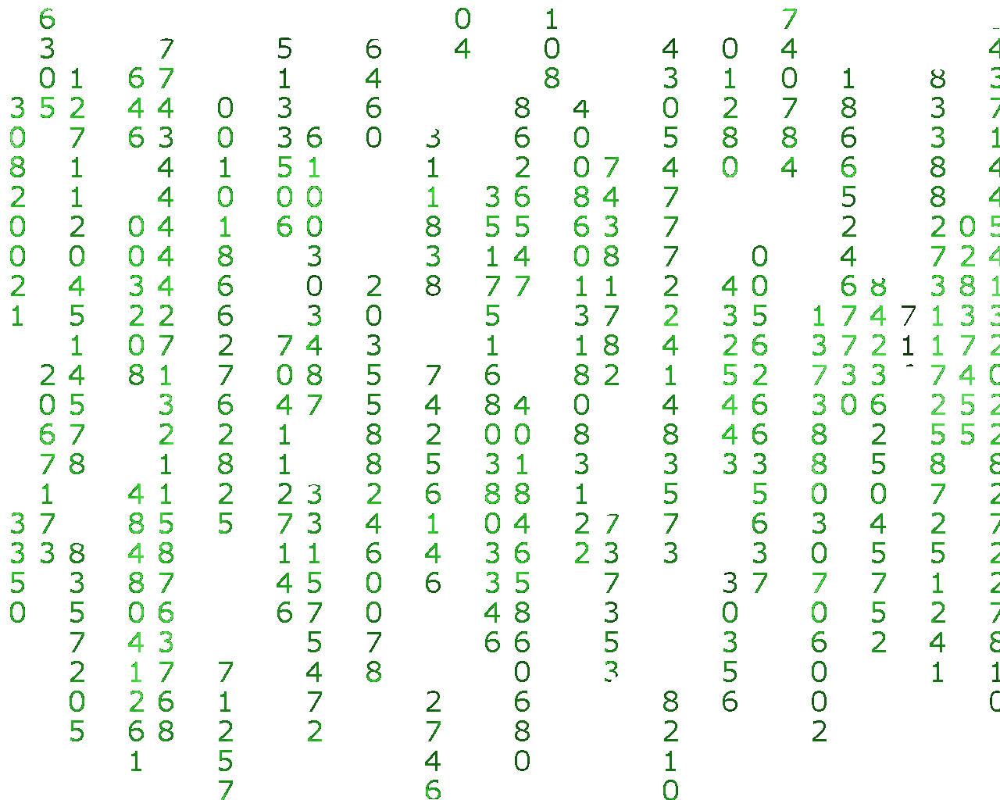
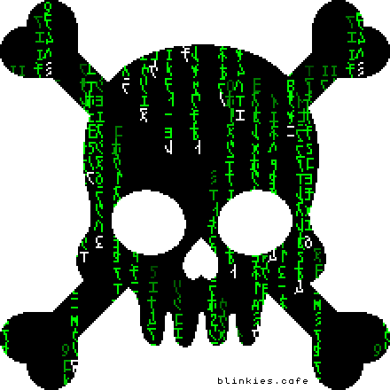

  <picture>
    <source media="(prefers-color-scheme: dark)" srcset="https://readme-typing-svg.herokuapp.com?font=Fira+Code&size=40&width=700&height=100&color=ffffff&center=false&pause=5000&repeat=true&lines=Gabriel+Suzin+Joaquim;👾+Software+Developer">
    
  </picture>

    
    

#  Hey there!

  I graduated as a **Technical in Information Technology** from the **Instituto Federal de Santa Catarina – Câmpus Caçador**, and I am currently pursuing a **Bachelor's degree in Systems Analysis and Development at UNIARP**. I'm constantly seeking to improve my methods and expand my knowledge!

---

##  Skills & Technologies

### 👨‍💻 Languages

<table>
  <tr>
    <td width=25%>
      
    </td>
    <td width=50% valign="top">
      
      
      
      
      
      
      
      
      
      
      
      
    </td>
    <td width=25%>
        
        <!-- caso quiser futuramente implementar horas de coding  -->
    </td>
  </tr>
</table>

### 🛠️ Tools, Frameworks & Others

<table>
  <tr>
    <td width=25%>
      
    </td>
    <td width=75% valign="top">
      
      
      
      
      
      
      
      
      
    </td>
  </tr>
</table>

##  Main Repos

  
Back-end Projects

  

<!-- 

  
▶ Front-end Projects

 -->

<!-- 

  
▶ Fullstack Projects

 -->

<!-- 

  
▶ Others Projects

 -->

##  Learning & Exploring

- **Pentesting** – Offensive security, ethical hacking, and system hardening skills
- **Game Development** – Creating interactive experiences with Luau and game engines, such as Roblox Studio and Unity 
- **Automation** – Building scripts and tools to simplify tasks  
- **Web Applications** – Developing front-end and back-end features  
- **Business Intelligence (BI)** – Analyzing and visualizing data for better decision-making  
- **Smart Solutions** – Applying tech to solve real-world problems  
- **Internet of Things (IoT)** – Connecting devices and data through sensors and networks

---

📫 Feel free to check out my projects or get in touch!
